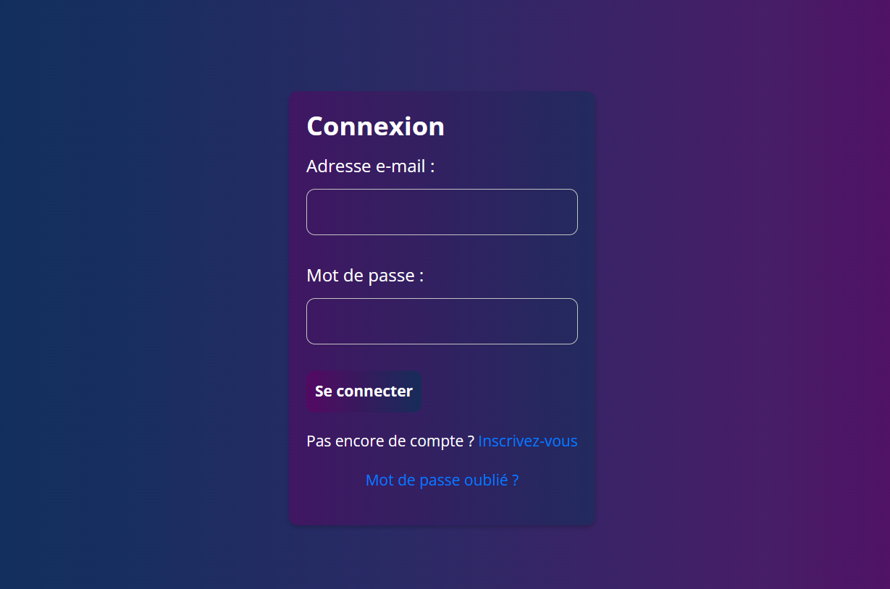
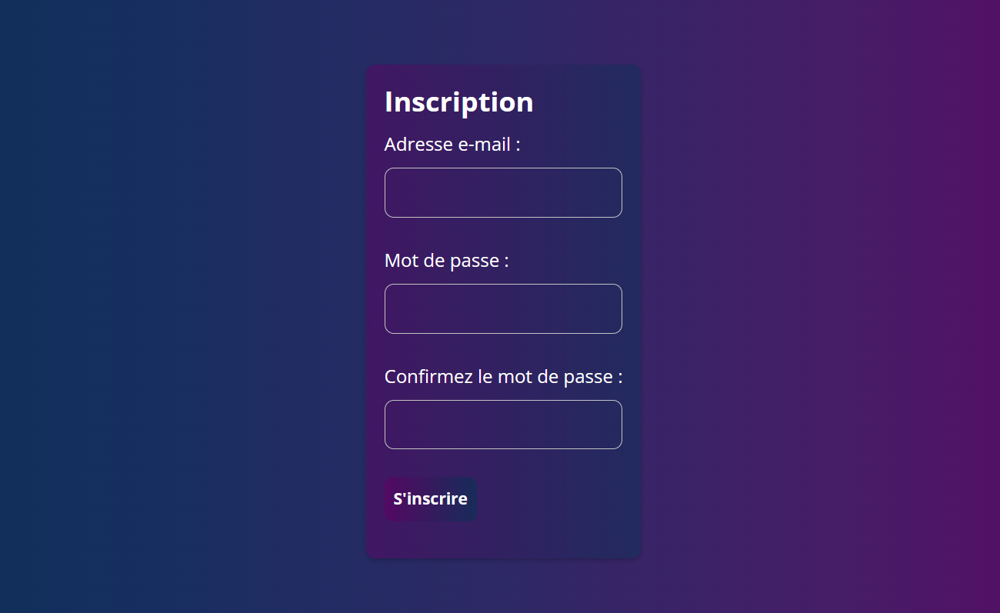
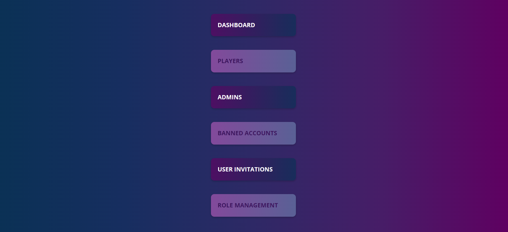
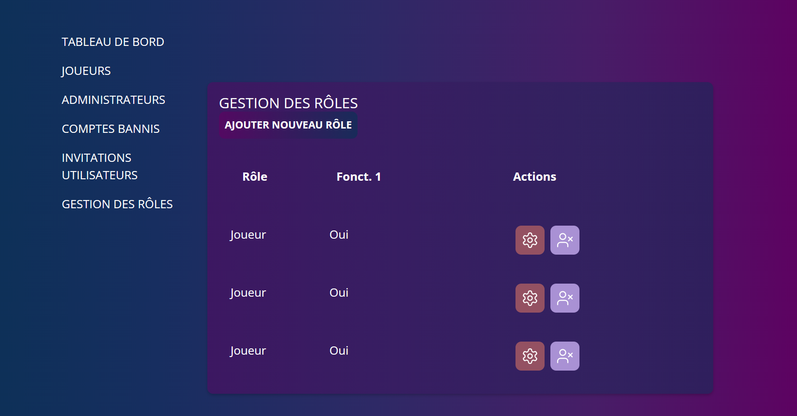
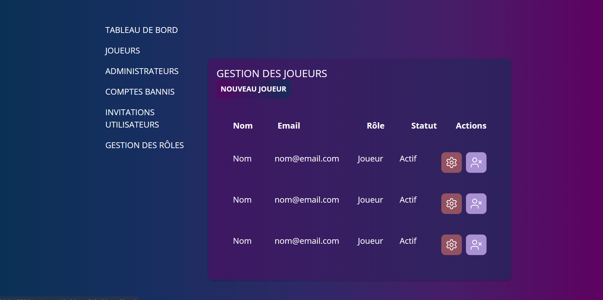
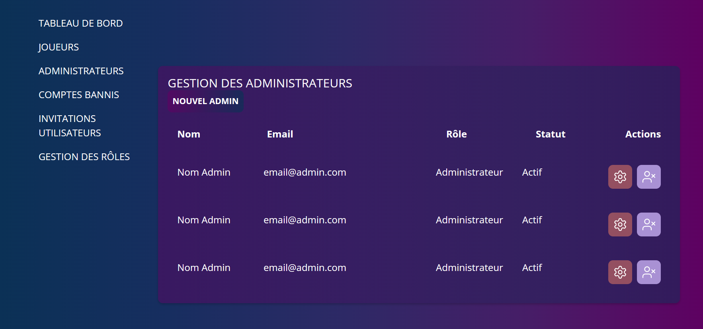

# Phase de Développement HTML/CSS

Cette phase concerne l'implémentation du design de Teamate en HTML et CSS, en suivant les maquettes de la phase de maquettage.

## Table des Matières
1. [Introduction](#introduction)
2. [Conception Implémentée](#conception-implémentée)
3. [Retour au README Principal](#retour-au-readme-principal)

## Introduction
Après la phase de maquettage, nous transposons les conceptions dans le code pour créer une expérience utilisateur interactive et fonctionnelle.

## Conception Implémentée

Voici comment les maquettes ont été traduites en pages web :

- **Login**:
    
  Voir le résultat en HTML : [login.html](../src/pages/login/login.html)

- **Enregistrement**:
    
  Voir le résultat en HTML : [register.html](../src/pages/register/register.html)

- **Dashboard**:
    
  Voir le résultat en HTML : [dashboard.html](../src/pages/dashboard/dashboard.html)

- **Gestion des Rôles**:
    
  Voir le résultat en HTML : [dashboard_roles.html](../src/pages/dashboard/roles/dashboard_roles.html)

- **Liste des Joueurs**:
    
  Voir le résultat en HTML : [dashboard_players.html](../src/pages/dashboard/players/dashboard_players.html)

- **Liste des Administrateurs**:
    
  Voir le résultat en HTML : [dashboard_admins.html](../src/pages/dashboard/admins/dashboard_admins.html)

## Retour au README Principal
Pour retourner au README principal à tout moment, cliquez ici : [README Principal](./README.md).
