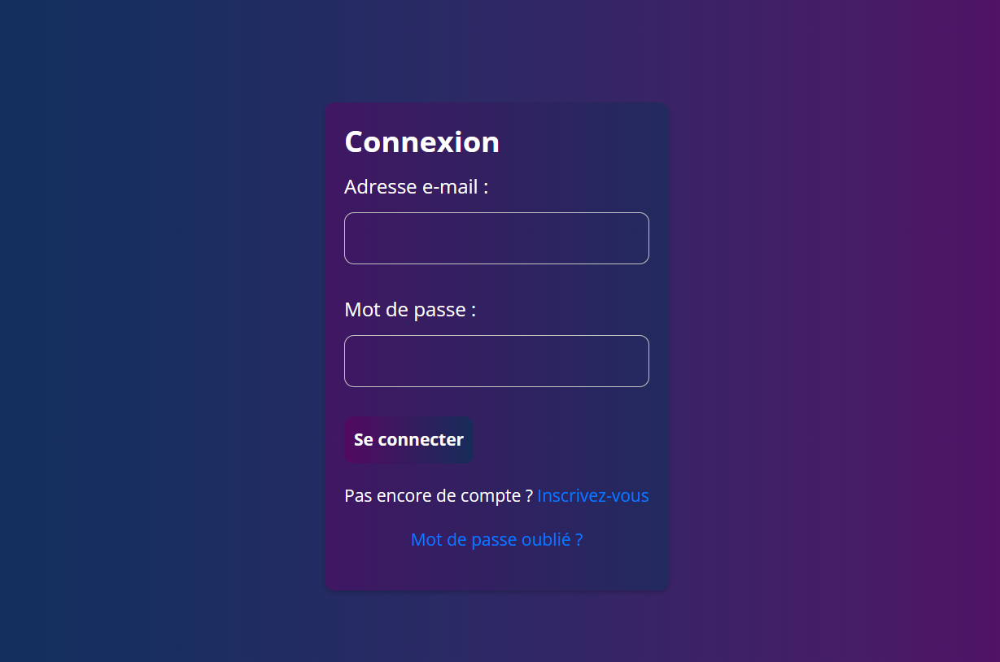
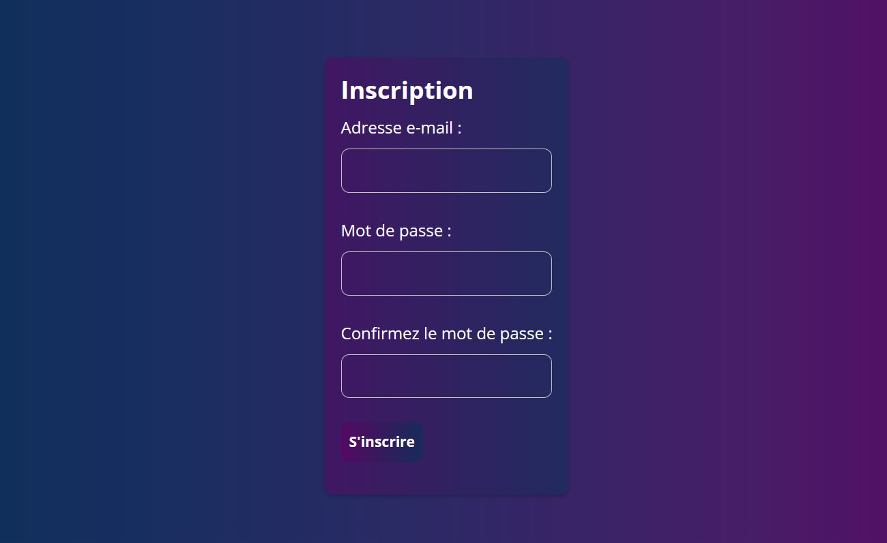
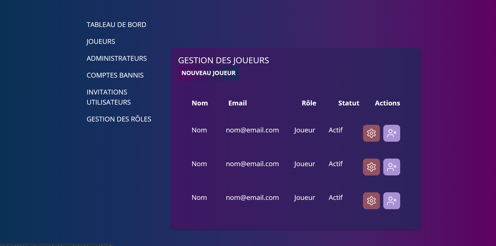

# Phase de Développement HTML/CSS

Cette phase concerne l'implémentation du design de Teamate en HTML et CSS, en suivant les maquettes de la phase de maquettage.

## Table des Matières
1. [Introduction](#introduction)
2. [Conception Implémentée](#conception-implémentée)
3. [Navigation entre les Pages](#navigation-entre-les-pages)
4. [Structure de Navigation HTML](#structure-de-navigation-html)
5. [Retour au README Principal](#retour-au-readme-principal)

## Introduction
Après la phase de maquettage, nous transposons les conceptions dans le code pour créer une expérience utilisateur interactive et fonctionnelle.

## Conception Implémentée

Voici comment les maquettes ont été traduites en pages web :

- **Login**:
    
  Voir le résultat en HTML : [login.html](../src/pages/login/login.html)

- **Enregistrement**:
    
  Voir le résultat en HTML : [register.html](../src/pages/register/register.html)

- **Dashboard**:
    
  Voir le résultat en HTML : [dashboard.html](../src/pages/dashboard/dashboard.html)

- **Gestion des Rôles**:
    
  Voir le résultat en HTML : [dashboard_roles.html](../src/pages/dashboard/roles/dashboard_roles.html)

- **Liste des Joueurs**:
    
  Voir le résultat en HTML : [dashboard_players.html](../src/pages/dashboard/players/dashboard_players.html)

- **Liste des Administrateurs**:
    
  Voir le résultat en HTML : [dashboard_admins.html](../src/pages/dashboard/admins/dashboard_admins.html)

## Navigation entre les Pages

La navigation entre les pages HTML s'effectue comme suit :

- **De `login.html`** : 
  - Accès au **Dashboard** via [dashboard.html](../src/pages/dashboard/dashboard.html)
  - Lien vers la page de **réinitialisation du mot de passe** via [forgot_password.html](../src/pages/forgot_password/reinitialisation_mp.html)
  - Lien vers la page d'**enregistrement** via [register.html](../src/pages/register/register.html)

- **De `register.html`** :
  - Lien vers la page de **vérification de l'email** via [verify_email.html](../src/pages/verify_email/verify_email.html), qui conduit ensuite à la page [verified.html](../src/pages/verified/verified.html)

- **Sur le Dashboard (`dashboard.html`)** :
  - Navigation vers les sections spécifiques telles que **Gestion des Rôles**, **Liste des Joueurs**, et **Liste des Administrateurs**, reflétant la structure et les liens internes définis précédemment.

## Structure de Navigation HTML

Voici une représentation structurée de la navigation entre les pages HTML dans le projet :

```
teamate/src/pages/
|
|-- login.html
|   |---> dashboard.html
|   |---> forgot_password.html --> reinitialisation_mp.html
|   `---> register.html --------> verify_email.html --> verified.html
|
`-- dashboard/
    |-- dashboard.html ----|--> admins/dashboard_admins.html
    |                      |---> banned_accs/dashboard_banned.html
    |                      |---> invitations/dashboard_invitations.html
    |                      |---> players/dashboard_players.html
    |                      `---> roles/dashboard_roles.html
|
|-- forgot_password/
|   `-- reinitialisation_mp.html
|
|-- register/
|   |-- register.html ----> verify_email.html
|   `-- verify_email.html --> verified.html
|
|-- verified/
|   `-- verified.html
|
`-- verify_email/
    `-- verify_email.html --> verified.html
```

Cette structure décrit de manière concise la navigation interne et les connexions entre les différentes pages HTML du projet, fournissant une vue d'ensemble de l'expérience utilisateur proposée.

## Retour au README Principal
Pour retourner au README principal à tout moment, cliquez ici : [README Principal](./README.md).
