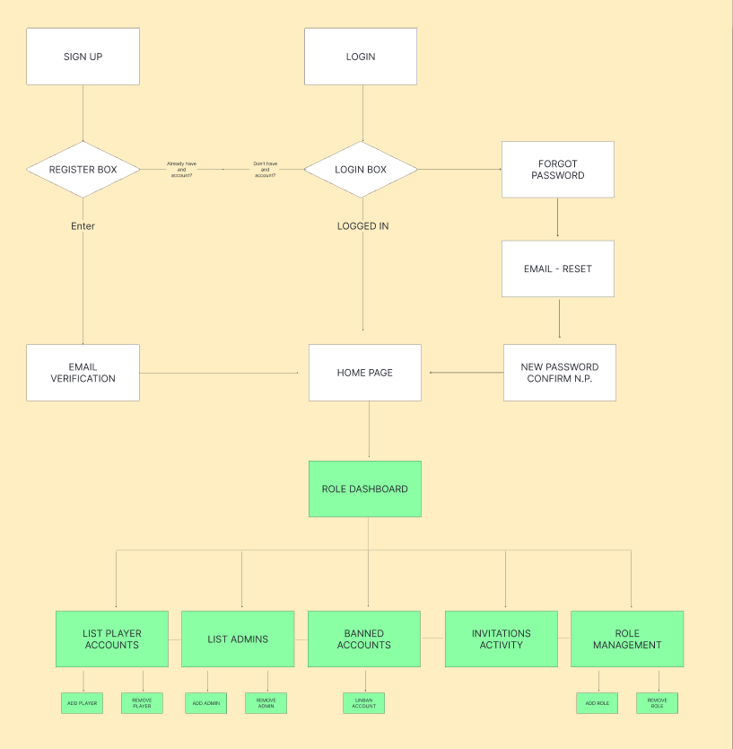
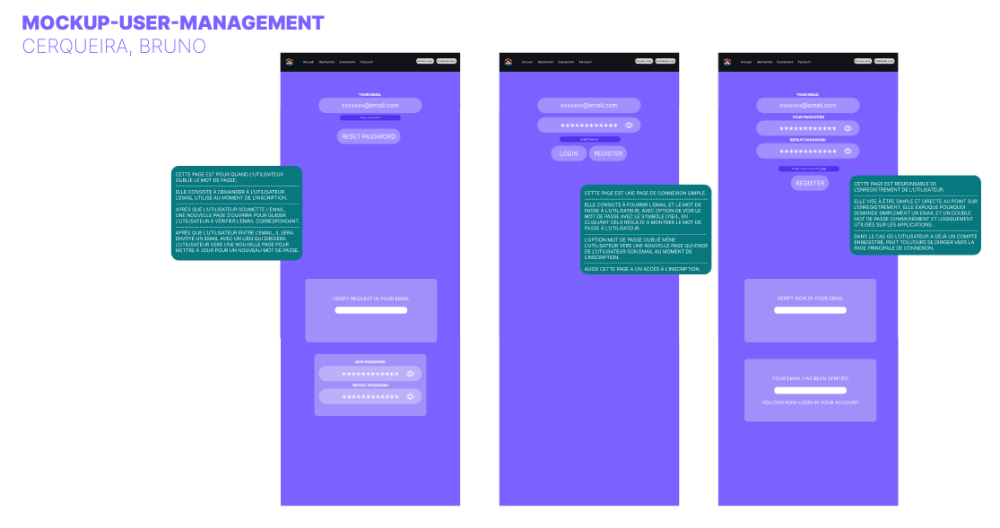
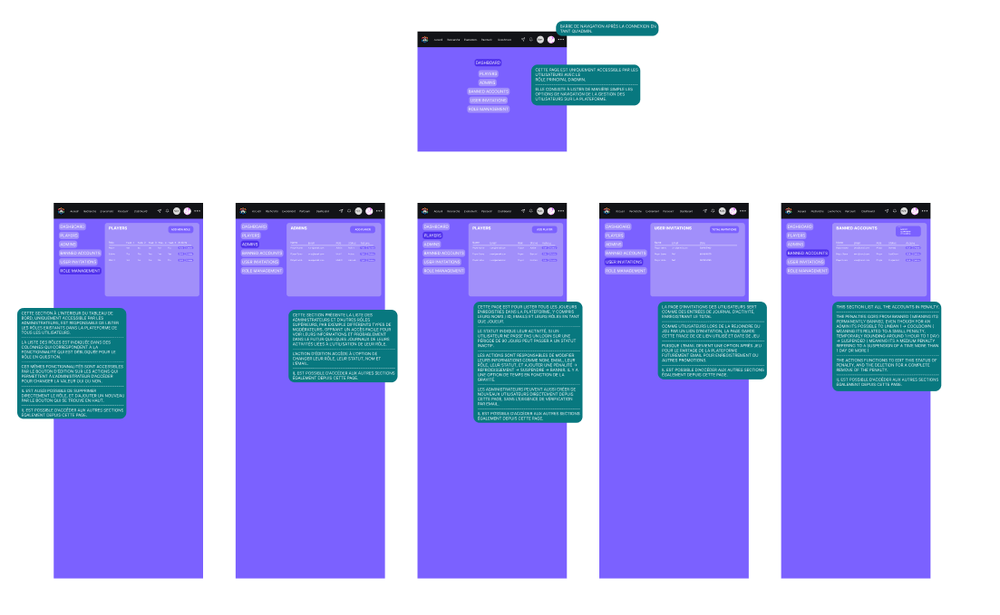
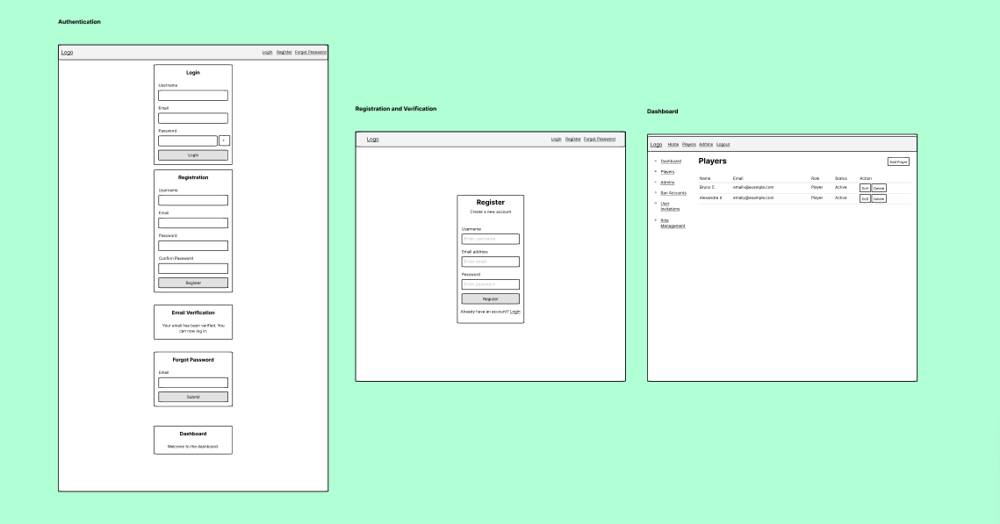

# Phase de Maquettage

La phase de maquettage est une étape cruciale du développement de Teamate. Elle nous permet de visualiser la structure et le design de l'application avant la mise en œuvre technique.

## Table des Matières
1. [Aperçu](#aperçu)
2. [Maquettes](#maquettes)
3. [Comparaison avec la Conception Finale](#comparaison-avec-la-conception-finale)

## Aperçu
Cette phase implique la création de maquettes détaillées qui servent de référence pour l'interface utilisateur et l'expérience utilisateur du projet.

## Maquettes

Voici les maquettes développées pour Teamate :

- **Charte Graphique**:
  
  La charte graphique détaille le schéma de couleurs, la typographie et les éléments visuels de base.

- **Mockup - Page de Connexion et Inscription**:
  
  Cette maquette montre la conception initiale des pages de connexion et d'inscription.

- **Mockup - Tableau de Bord**:
  
  Illustration du tableau de bord et des différentes sections pour la gestion des utilisateurs.

- **Wireframe Général**:
  
  Le wireframe offre une vue d'ensemble simplifiée du flux de navigation de l'application.

## Comparaison avec la Conception Finale

Une fois la phase HTML/CSS atteinte, nous comparerons ces maquettes avec l'implémentation finale pour évaluer la fidélité de la conception et apporter des ajustements si nécessaire.

Pour retourner au menu principal du README à tout moment, utilisez ce lien : [README Principal](./README.md).
